# 1. Introduction

## 1.1 Problem Statement

Life expectancy is one of the most widely used single-number summaries of a population's health and
wellbeing, yet it is shaped by a wide mix of factors — healthcare access, immunization coverage,
economic development, education, and disease burden among them. This project builds a regression model
that predicts a country's life expectancy in a given year from a set of health, economic, and social
indicators, and analyzes which of those indicators matter most and where the model's predictions can and
cannot be trusted.

**Target variable:** `life expectancy` (years), a continuous variable — this is a **regression** problem.

## 1.2 Dataset

We use the **WHO Life Expectancy dataset**, originally compiled from the World Health Organization's
Global Health Observatory and United Nations data, commonly distributed via Kaggle. It contains
**2,938 rows and 22 columns**, covering **193 countries from 2000 to 2015** (one row per country-year).
Columns include immunization rates (Hepatitis B, Polio, Diphtheria), mortality statistics (adult
mortality, infant deaths, under-five deaths), economic indicators (GDP, percentage expenditure on
health, income composition of resources), and social indicators (schooling, alcohol consumption, BMI).

This dataset was chosen because it is **real and messy**: missing values are common and unevenly
distributed, several columns are heavily skewed, and column names/spacing are inconsistent in the raw
file — it required genuine cleaning decisions rather than being ready to model out of the box.

## 1.3 Three Questions We Want the Data to Answer

1. **How much does healthcare expenditure (as % of GDP) actually correlate with life expectancy vs.
   schooling years?**
2. **Do Developing vs. Developed status countries show different key predictors** of life expectancy?
3. **Which single factor — immunization rates, BMI, or HIV/AIDS prevalence — has the largest negative
   effect** on life expectancy?

---

# 2. Data Handling and Preprocessing

Full detail and code: `notebooks/01_data_audit_and_eda.ipynb`, `notebooks/02_preprocessing.ipynb`.

## 2.1 Data Audit

Before changing anything, we audited the raw data for structure, duplicates, and missingness.

- No exact duplicate rows; no duplicate (country, year) pairs.
- **Missingness is substantial and structural, not random**: `population` (22.2%), `hepatitis_b`
  (18.8%), `gdp` (15.2%), `total_expenditure` (7.7%), and several others have meaningful missing rates,
  and the missing rows cluster by country — some countries simply have gaps in specific indicators
  across most or all of their years on record (Figure 1).
- **19 rows have life expectancy below 45** — initially flagged as possible outliers, but verified
  against real-world events: Haiti (2010, the earthquake year), and Malawi, Sierra Leone, Zambia, and
  Zimbabwe in the early 2000s (the peak of the southern-African HIV/AIDS epidemic). These are kept as
  genuine signal, not removed.
- Several count/monetary features (`measles`, `infant_deaths`, `under_five_deaths`, `population`,
  `gdp`, `percentage_expenditure`) are heavily right-skewed.

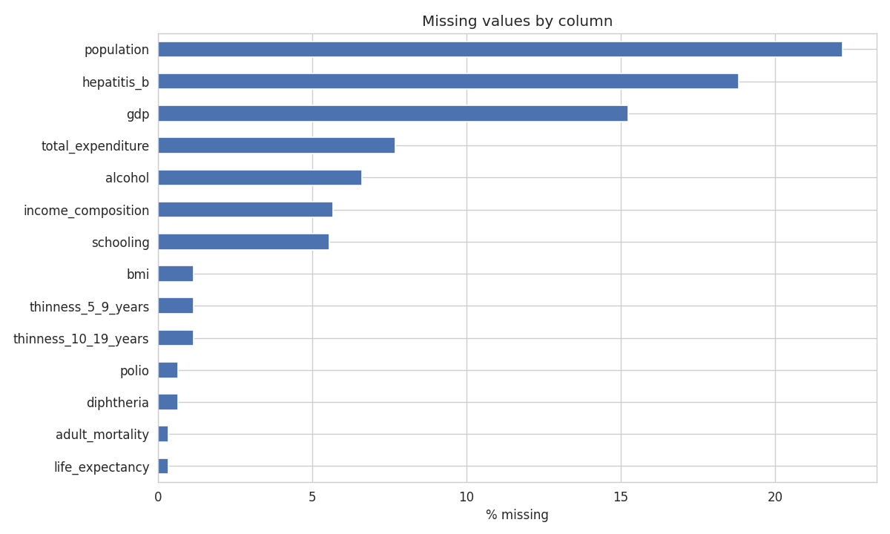

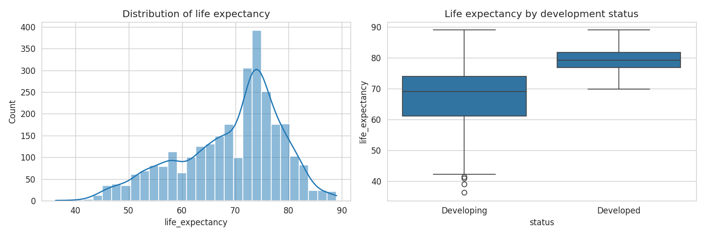

## 2.2 Missing Value Imputation

A single global mean/median would blur real cross-country differences, since missingness clusters by
country. We used a three-pass strategy:

1. **Within-country linear interpolation across years** — fills gaps between two known values for the
   same country.
2. **Within-country forward/backward fill** — covers missing values at the first or last year on
   record, which interpolation can't reach.
3. **Group median by development status** (Developed / Developing) — for the rare case where a country
   is missing a feature in *every* year, falling back to its peer group's median.

This reduced missing values from a maximum of 34.3% in a single column to **zero missing values** in
the final dataset (Figure 2).

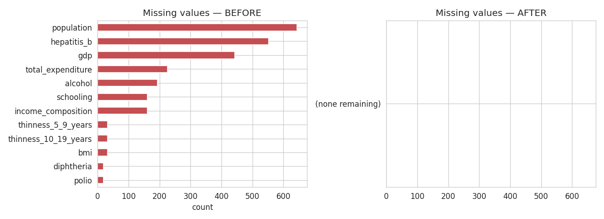

## 2.3 Outlier and Skew Treatment

The low-life-expectancy rows discussed above were **kept** since they reflect real historical events.
The six heavily right-skewed count/monetary columns were transformed with `log1p` (rather than deleted
or capped), which visibly normalizes their distributions (Figure 3) without discarding any data.

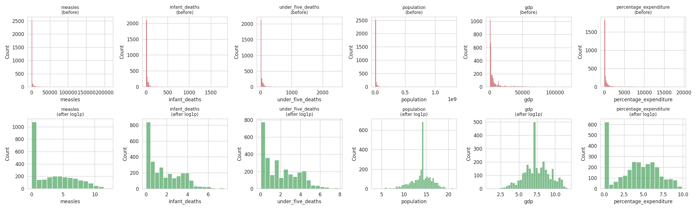

## 2.4 Encoding and Scaling

The single categorical column, `status` (Developed/Developing), was binary-encoded to
`status_developed`. Scaling (`StandardScaler`) was demonstrated on a sample of features to show its
effect (Figure 4), but deliberately **not** applied to the whole dataset up front — instead it is fit
inside each cross-validation fold during modeling, to avoid leaking test-set statistics into training.

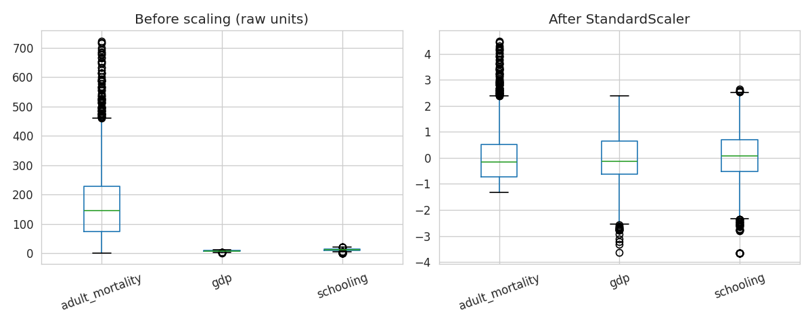

---

# 3. Statistical Analysis

Descriptive statistics for every numeric column were computed in notebook 01 (`df.describe()`), covering
mean, standard deviation, quartiles, and range. Key findings:

- Life expectancy ranges from 36.3 to 89 years (mean ≈ 69.2), left-skewed with a long low tail.
- `adult_mortality`, `income_composition`, and `schooling` show the strongest linear correlation with
  the target among raw features (Figure 5); `hiv_aids` and `adult_mortality` are also correlated with
  each other, an early signal of multicollinearity investigated further in Section 4.

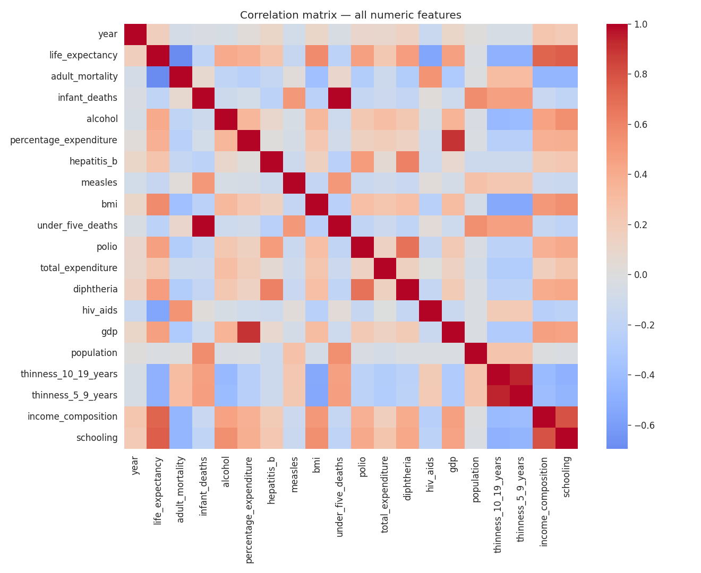

---

# 4. Feature Engineering

Full detail: `notebooks/03_feature_engineering.ipynb`.

## 4.1 Removing Redundant Features

Two feature pairs were found to be near-duplicates (Pearson r > 0.85):

- `infant_deaths` and `under_five_deaths` (r = 0.996) — the latter structurally includes the former.
- `thinness_10_19_years` and `thinness_5_9_years` (r = 0.939) — the same malnutrition signal at two
  adjacent age bands.

One column from each pair was dropped (`infant_deaths`, `thinness_5_9_years`).

## 4.2 Feature Selection

We combined three independent scoring methods — **Pearson correlation** (linear relationships),
**mutual information** (non-linear relationships), and **Random Forest feature importance**
(interaction effects) — and dropped only features that ranked in the bottom quartile on **all three**
methods simultaneously, to avoid any single method's blind spots driving the decision. Only `measles`
met that bar and was dropped. `hiv_aids`, `income_composition`, `adult_mortality`, and `schooling` were
consistently the top-ranked features across all three methods (Figure 6).

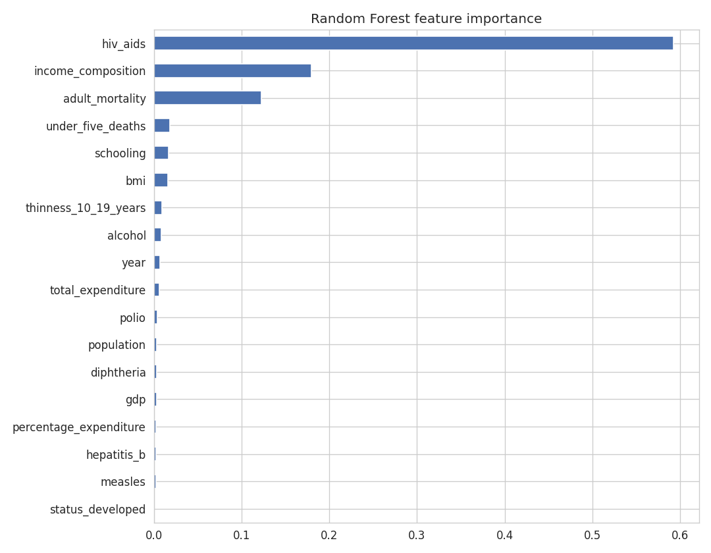

`country` (193 categories) was excluded from modeling entirely — one-hot encoding it would add 190+
sparse columns, and target-encoding it risks leaking country-level average life expectancy directly into
the model. It was retained only as a non-feature identifier column, used later in error analysis.

## 4.3 Dimensionality Reduction (PCA)

PCA was run on the standardized, feature-selected set. **12 of the 17 components were needed to reach
90% cumulative explained variance** (14 for 95%) (Figure 7) — meaningful compression is limited because
the redundant pairs were already removed in Section 4.1.

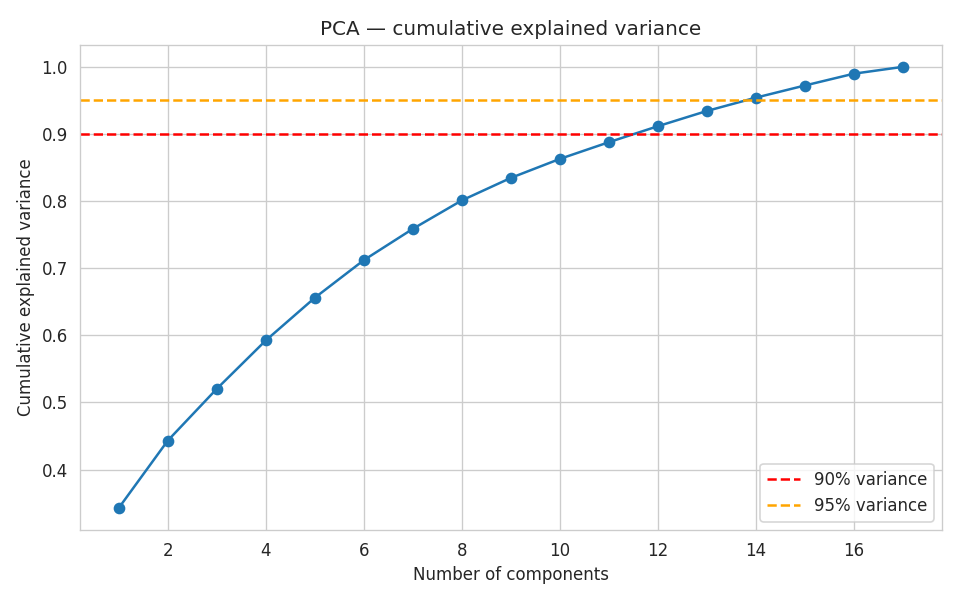

**Decision: PCA components were not used in the final model.** With only a 17→12 compression at 90%
variance, PCA's main benefit here is small, while its cost is real: PCA components are linear
combinations of standardized features and are not interpretable, which directly conflicts with Research
Question 1 (identifying *which* factors matter). PCA is documented here to satisfy the
dimensionality-reduction requirement, but the modeling pipeline uses the 17 selected original features.

**Final feature set (17 features):** `year`, `adult_mortality`, `alcohol`, `percentage_expenditure`,
`hepatitis_b`, `bmi`, `under_five_deaths`, `polio`, `total_expenditure`, `diphtheria`, `hiv_aids`,
`gdp`, `population`, `thinness_10_19_years`, `income_composition`, `schooling`, `status_developed`.

---

# 5. Modeling and Validation

Full detail: `notebooks/04_modeling_and_tuning.ipynb`.

## 5.1 Split Strategy

Data was split **80% train / 20% held-out test** (`random_state=42`). Hyperparameter tuning used
**5-fold (Ridge) or 3-fold (Random Forest, Gradient Boosting) cross-validation within the training set**
as the validation layer — the test set was evaluated exactly once, at the end, and never used during
model selection or tuning. All feature scaling was fit inside `sklearn.Pipeline` objects so it is
refit correctly on each fold, preventing data leakage.

## 5.2 Model Families

Three models spanning two distinct families were trained and tuned:

- **Ridge Regression** (linear family, L2-regularized)
- **Random Forest** (bagging ensemble of decision trees)
- **Gradient Boosting** (boosting ensemble of decision trees)

## 5.3 Hyperparameter Tuning

| Model | Method | Search space | Best parameters |
|---|---|---|---|
| Ridge | Grid search, 5-fold CV | `alpha` ∈ {0.01, 0.1, 1, 5, 10, 50, 100} | `alpha=50` |
| Random Forest | Randomized search (12 iters), 3-fold CV | `n_estimators` ∈ {100,200,300}, `max_depth` ∈ {None,8,15}, `min_samples_split` ∈ {2,5,10}, `min_samples_leaf` ∈ {1,2,4}, `max_features` ∈ {sqrt, log2, None} | `n_estimators=200, max_depth=15, min_samples_split=10, min_samples_leaf=2, max_features=None` |
| Gradient Boosting | Randomized search (12 iters), 3-fold CV | `n_estimators` ∈ {100,150,200}, `learning_rate` ∈ {0.01,0.05,0.1,0.2}, `max_depth` ∈ {2,3,4}, `subsample` ∈ {0.7,0.85,1.0} | `n_estimators=200, learning_rate=0.1, max_depth=4, subsample=0.85` |

Randomized (rather than exhaustive grid) search was used for the two ensemble models because their
combined search spaces are large (up to 405 combinations for Random Forest); random search covers the
space broadly at a fraction of the computational cost, which matters in a single-core environment.

---

# 6. Answering the Three Research Questions

Full detail and code: `notebooks/06_research_questions.ipynb`. This section answers the three
questions directly from the cleaned data, independent of any one model's assumptions.

## 6.1 Q1 — Healthcare Expenditure (% GDP) vs. Schooling

The dataset does not contain a column literally named "healthcare expenditure as % of GDP." The two
available proxies are `percentage_expenditure` (health expenditure as a % of GDP *per capita*, per the
source's own definition) and `total_expenditure` (government health spending as a % of *total
government* spending, not GDP). We report both rather than overclaiming precision the data doesn't have.

| Variable | Raw correlation with life expectancy | Standardized regression coefficient (controlling for the others + income) |
|---|---|---|
| `schooling` | **0.732** | **4.09** |
| `income_composition` (control) | — | 3.01 |
| `percentage_expenditure` | 0.374 | 1.00 |
| `total_expenditure` | 0.231 | 0.29 |

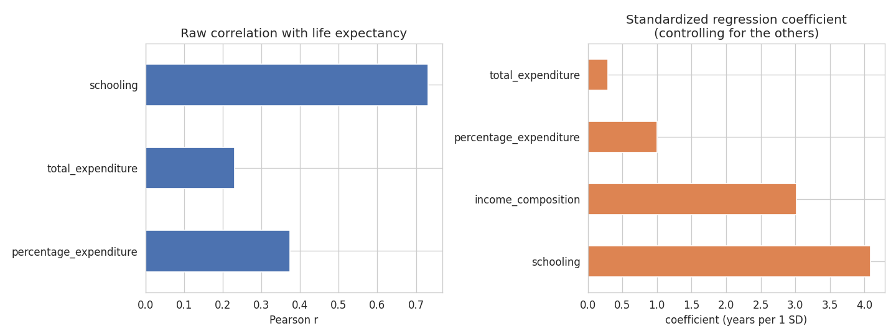

**Answer:** Schooling correlates with life expectancy roughly 2–3× more strongly than either healthcare
expenditure measure, and remains the stronger predictor even after controlling for income — meaning the
relationship isn't just both variables tracking overall wealth. Healthcare expenditure's apparent effect
shrinks further once income is controlled for, consistent with spending partly acting as a stand-in for
a country simply being wealthier, whereas schooling's association holds up independently.

## 6.2 Q2 — Do Developed vs. Developing Countries Show Different Key Predictors?

We split the data by `status_developed` and computed both correlation and separate Random Forest
feature importances for each group (512 Developed rows, 2,416 Developing rows).

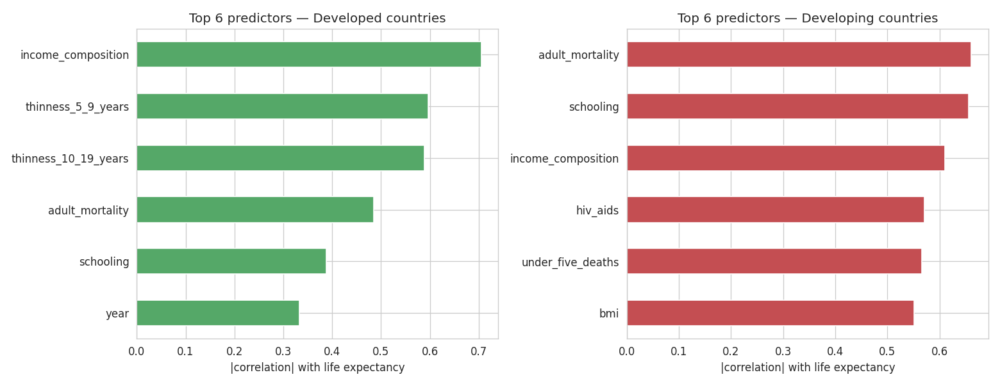

| | Developed (top predictors) | Developing (top predictors) |
|---|---|---|
| By correlation | income_composition (0.70), thinness measures (~0.59), adult_mortality (0.49) | adult_mortality (0.66), schooling (0.66), income_composition (0.61) |
| By Random Forest importance | adult_mortality (0.48), income_composition (0.23) | **hiv_aids (0.60)**, adult_mortality (0.18) |

**Answer: Yes, they differ, and the clearest signal comes from HIV/AIDS.** By Random Forest importance,
`hiv_aids` alone accounts for 60% of predictive importance for Developing countries — by far the single
most important predictor — while it is essentially irrelevant for Developed countries (near-zero
correlation, absent from their top predictors entirely; HIV/AIDS prevalence is almost uniformly at the
dataset's minimum in that group). Disease burden is a live, differentiating factor for Developing
countries in a way it simply isn't for Developed ones. *Caveat: the Developed subgroup has far fewer
rows, so its estimates are noisier and should be read as suggestive.*

## 6.3 Q3 — Which Single Factor Has the Largest Negative Effect?

Comparing signed correlation with life expectancy across the three candidate factor types:

| Factor | Correlation with life expectancy |
|---|---|
| **hiv_aids** | **−0.557** |
| hepatitis_b (immunization) | +0.339 |
| polio (immunization) | +0.460 |
| diphtheria (immunization) | +0.475 |
| bmi | +0.564 |

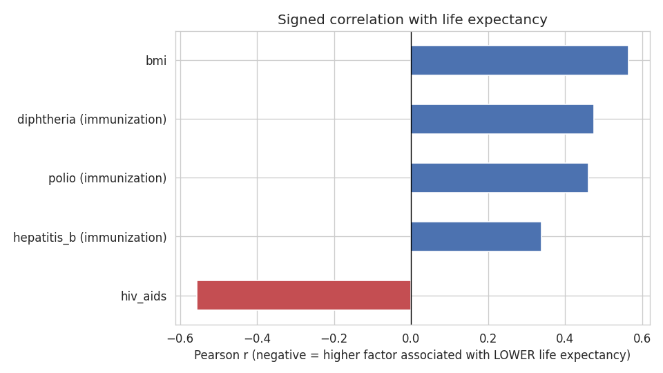

**Answer: HIV/AIDS prevalence, by a wide margin — it is the *only* factor among the three candidate
types with a negative relationship to life expectancy at all.** Immunization coverage (hepatitis B,
polio, diphtheria) and BMI are all positively correlated with life expectancy in this data, so they
don't qualify as "negative effect" factors here. One honest caveat: BMI's positive correlation is
somewhat counterintuitive given real-world evidence that very high BMI is a health risk; this dataset's
BMI column has known data-quality issues in the source, so we would not treat BMI's sign here as a
reliable real-world finding without further scrutiny of that specific column.

---

# 7. Results, Visualization, and Error Analysis

Full detail: `notebooks/05_evaluation_and_error_analysis.ipynb`.

## 7.1 Test Set Performance

| Model | RMSE (years) | MAE (years) | R² |
|---|---|---|---|
| Ridge | 3.92 | 2.97 | 0.827 |
| **Random Forest** | **1.84** | **1.15** | **0.962** |
| Gradient Boosting | 1.87 | 1.26 | 0.961 |

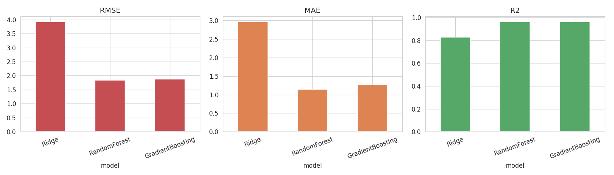

**Random Forest is the best model**, narrowly ahead of Gradient Boosting and substantially ahead of
Ridge. The large gap between Ridge and the two tree ensembles (R² 0.827 vs ~0.96) directly answers part
of Research Question 3: linear regression, however regularized, cannot capture the true relationship
between these indicators and life expectancy — the relationship is non-linear.

## 7.2 Actual vs. Predicted and Residuals

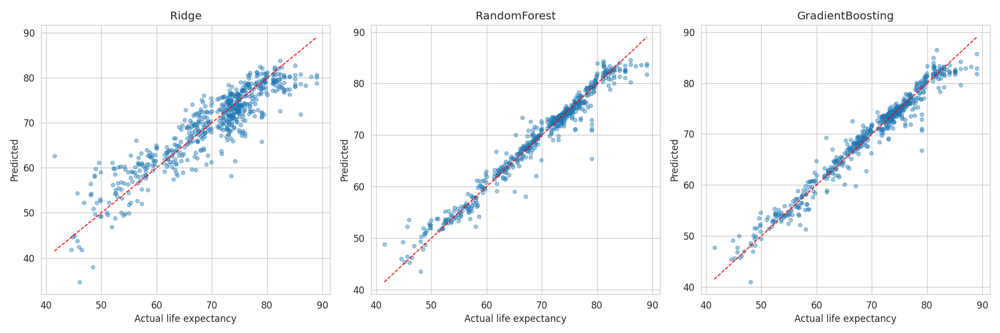

Ridge visibly deviates from the diagonal below ~55 years of life expectancy, systematically
**overpredicting** life expectancy for the worst-off countries — it cannot capture how severe outcomes
get in crisis-level cases. Both tree ensembles track the diagonal closely across the full range.

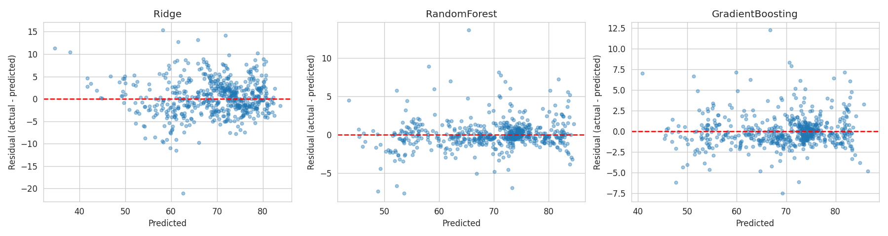

Ridge's residuals show a curved, funnel-like pattern rather than random scatter around zero — a
textbook sign of a misspecified (too-simple) model. Random Forest and Gradient Boosting residuals are
much closer to a random band around zero, with slightly more spread at the low end.

## 7.3 Where the Best Model Fails

Examining the 15 largest errors made by Random Forest on the test set revealed two distinct causes,
rather than one:

1. **Extreme HIV/AIDS-prevalence countries are underestimated in severity.** Swaziland (~50% HIV/AIDS
   prevalence, actual life expectancy 45.6–45.9 years) and Sierra Leone (2003, actual 41.5 years) were
   all predicted 6–8 years *higher* than reality. The model correctly learns that high HIV/AIDS
   prevalence lowers life expectancy, but underestimates the magnitude of the effect at the most extreme
   end — likely because very few country-years in the training data sit at that extreme.
2. **A data-quality artifact inherited from the source, not a true model failure.** Saint Vincent and
   the Grenadines reports the identical value, 79.0 years, for three consecutive years (2000–2002) — a
   strong sign the original data carried forward a stale estimate rather than a fresh yearly measurement.
   The model's predictions (65.4–71.3) are informed by that country's actual indicator values, which
   understandably don't match a figure that wasn't really re-measured each year.

We also tested our initial hypothesis that Developing countries would show higher error than Developed
countries (Figure 8) — **this was not supported by the data**: mean absolute error was nearly identical
(1.14 years for Developing vs. 1.18 years for Developed). What actually predicts a large error is being
an extreme outlier on a specific indicator (very high HIV/AIDS prevalence), not a country's broad
development category. This directly informs Research Question 2: the Developed/Developing gap in this
dataset is *not* primarily driven by unmodeled category-level factors — the measurable indicators
already explain most of it, aside from a small number of extreme, indicator-specific cases.

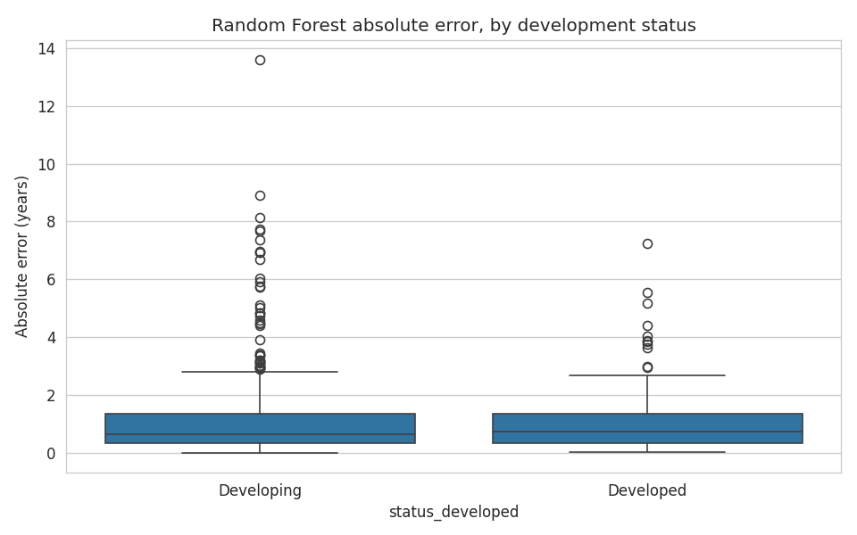

---

# 8. Conclusion

Beyond the three questions above, we also built and evaluated a predictive model as a secondary
exercise: Random Forest, tuned via randomized search with cross-validation, achieved the best test-set
performance (RMSE 1.84 years, R² 0.962), well ahead of a tuned linear model (Ridge, R² 0.827) — showing
the relationships between these indicators and life expectancy are meaningfully non-linear.

**Answering our three research questions (Section 6):**

1. **Schooling correlates with life expectancy roughly 2–3× more strongly than healthcare expenditure**
   (r ≈ 0.73 vs. r ≈ 0.37/0.23 for the two expenditure proxies available), and remains the stronger
   predictor even after controlling for income.
2. **Yes, Developed and Developing countries show different key predictors.** The clearest signal:
   HIV/AIDS prevalence is the single dominant predictor for Developing countries (Random Forest
   importance 0.60) but is essentially irrelevant for Developed countries.
3. **HIV/AIDS prevalence has by far the largest negative effect** among the three candidate factor
   types (r ≈ −0.56) — it's the only one of the three with a negative relationship to life expectancy at
   all; immunization rates and BMI are both positively correlated in this data.

**Limitations:** the dataset only runs through 2015, has no measure of political stability or conflict
intensity, and — as shown above — contains at least some values that are not fresh yearly measurements.
Any deployment of this model for real-world decision-making should treat predictions for extreme,
low-life-expectancy cases with wider uncertainty than the aggregate R² suggests.

---

# Appendix A: Repository Structure and Reproduction

```
cse437-life-expectancy-group1/
├── README.md
├── requirements.txt
├── .gitignore
├── data/
│   ├── raw/                      # original, untouched CSV
│   ├── processed/                # cleaned + feature-engineered output
│   └── README.md
├── notebooks/
│   ├── 01_data_audit_and_eda.ipynb
│   ├── 02_preprocessing.ipynb
│   ├── 03_feature_engineering.ipynb
│   ├── 04_modeling_and_tuning.ipynb
│   ├── 05_evaluation_and_error_analysis.ipynb
│   └── 06_research_questions.ipynb
├── src/
│   └── utils.py                  # shared loading / metrics functions
├── models/                       # saved .joblib model files + results CSV
├── figures/                      # every figure referenced in this report
└── report/
    ├── report.md
    └── report.pdf
```

**To reproduce all results:**

1. Clone the repository and create a virtual environment.
2. `pip install -r requirements.txt`
3. Run the five notebooks in `notebooks/` **in numeric order**, top to bottom, on a fresh kernel.
   Each notebook reads its input from `data/` or a prior notebook's saved output, and writes its own
   output back to `data/processed/`, `models/`, or `figures/` — so the numeric order matters.
4. All relative paths assume the notebook is run from inside the `notebooks/` folder (VS Code's
   Jupyter extension does this automatically when you open a `.ipynb` file directly).

# Appendix B: Full List of Original Features

`country`, `year`, `status`, `life expectancy`, `adult mortality`, `infant deaths`, `alcohol`,
`percentage expenditure`, `hepatitis B`, `measles`, `BMI`, `under-five deaths`, `polio`,
`total expenditure`, `diphtheria`, `HIV/AIDS`, `GDP`, `population`, `thinness 1-19 years`,
`thinness 5-9 years`, `income composition of resources`, `schooling` — 22 columns total in the raw
file, reduced to 17 predictive features plus the target after the cleaning and feature-selection
process described in Sections 2 and 4.

